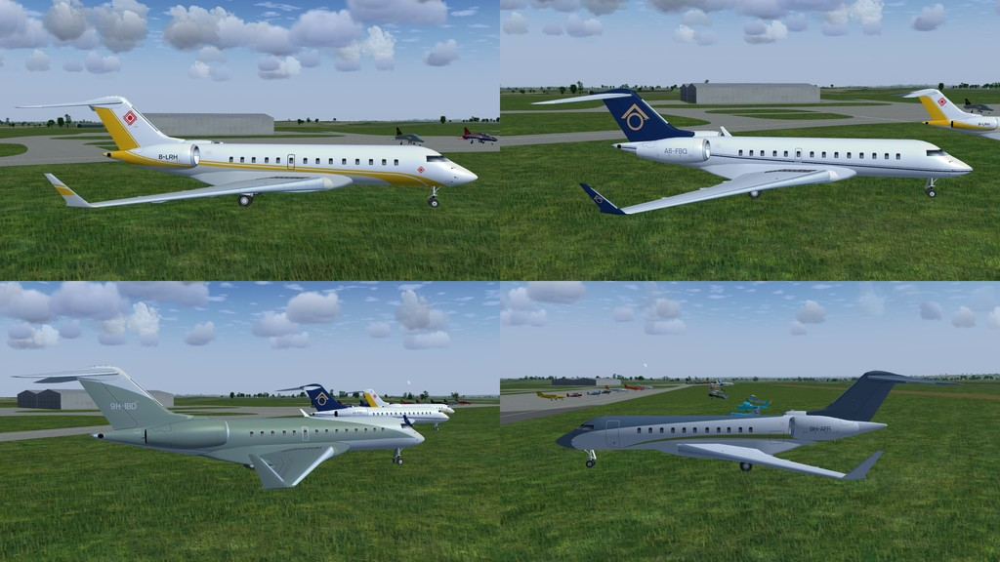
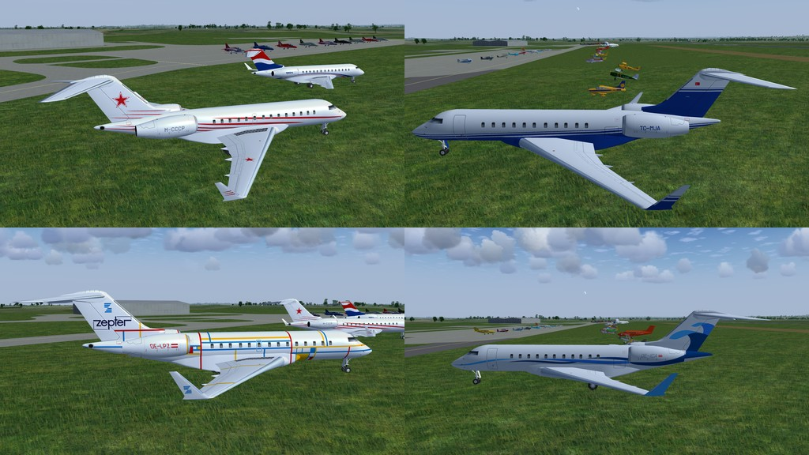
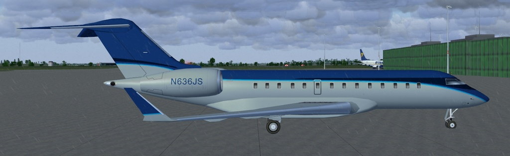
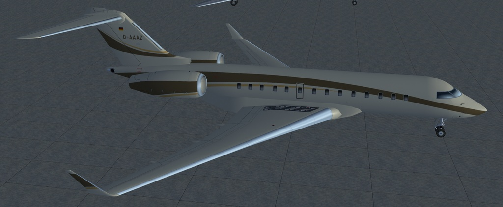

# Bombardier-Global-5000

**Bombardier Global 5000 AI aircraft for use in FlightGear flight simulator.**

*Although this is already in FlightGear this version has added navigation and landing lights added plus extra liveries.*

Download the zip file and extract the "CCX" folder into the "$FG_ROOT/AI/Aircraft" folder.

To use you will need to create a traffic file, see the wiki for instructions.
 http://wiki.flightgear.org/AI_Traffic

There is a simple AI Traffic Creator here: 
https://github.com/gooneybird47/FlightGear-AI-Traffic-Creator

